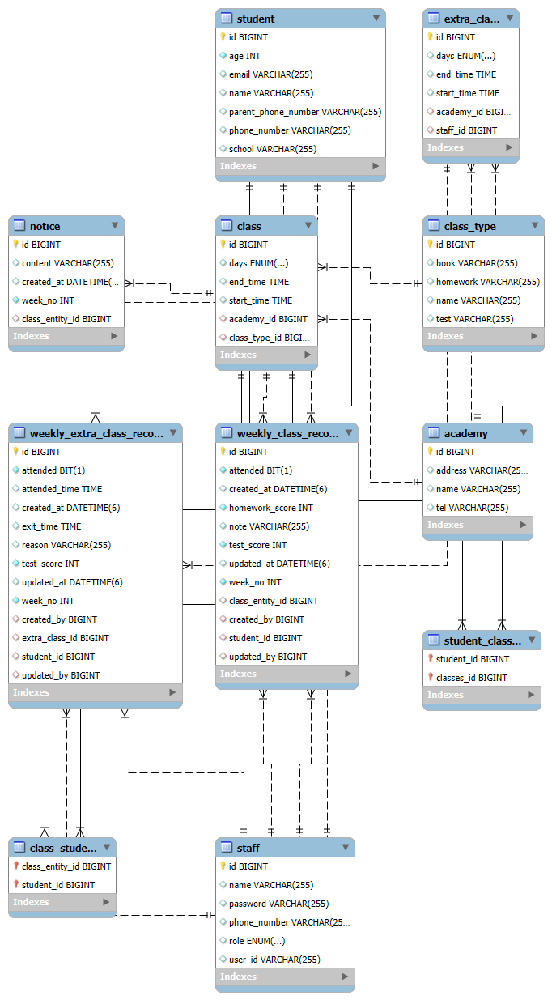

# TA-Helper
teaching assistant helper tool

학원 조교로 일했을 때, 업무 처리방식에 불편함을 느껴 구현한 웹 서비스.

메일 기반으로 학생, 수업정보 파일을 공유하는 협업 방식에 비효율을 느끼고, 
조교 간 공유 자동화 웹 서비스를 직접 기획하고 구현했습니다.

---
# REST API
API 문서
- [ACADEMY.md](src/docs/ACADEMY.md)
  - 학원 정보
- [CLASS.md](src/docs/CLASS.md)
  - 수업 정보
- [CLASS_TYPE.md](src/docs/CLASS_TYPE.md)
  - 수업의 타입 정보 (ex. 개념반, 심화반)
- [EXTRA_CLASS.md](src/docs/EXTRA_CLASS.md)
  - 보충 수업 정보 (ex. 월요일 13시 보충 수업)
- [NOTICE API.md](src/docs/NOTICE%20API.md)
  - 공지 사항 정보
- [STAFF.md](src/docs/STAFF.md)
  - 조교 정보
- [STUDENT.md](src/docs/STUDENT.md)
  - 학생 정보
- [WEEKLY_CLASS_RECORD.md](src/docs/WEEKLY_CLASS_RECORD.md)
  - 학생들의 주간 수업 기록 정보
- [WEEKLY_EXTRA_CLASS_RECORD.md](src/docs/WEEKLY_EXTRA_CLASS_RECORD.md)
  - 학생들의 주간 보충 수업 기록 정보

---

# ERD

# 피드백

[FEEDBACK.md](FEEDBACK.md)